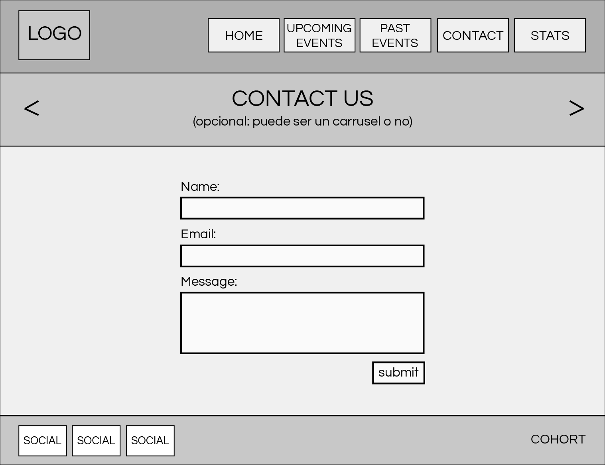
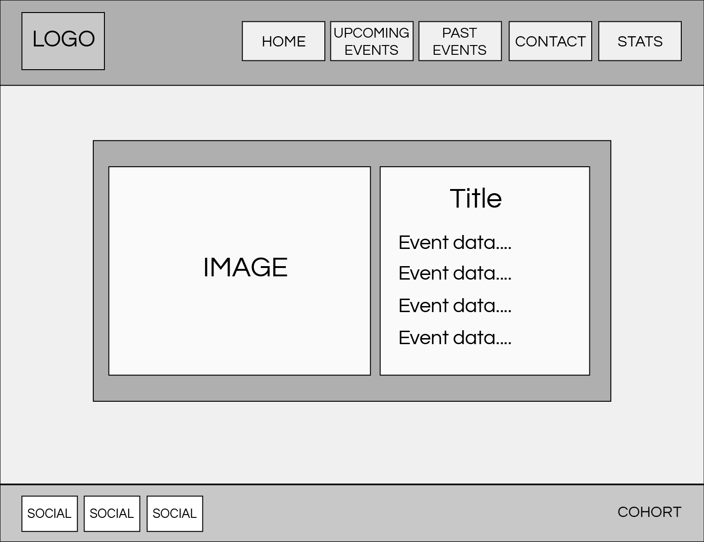
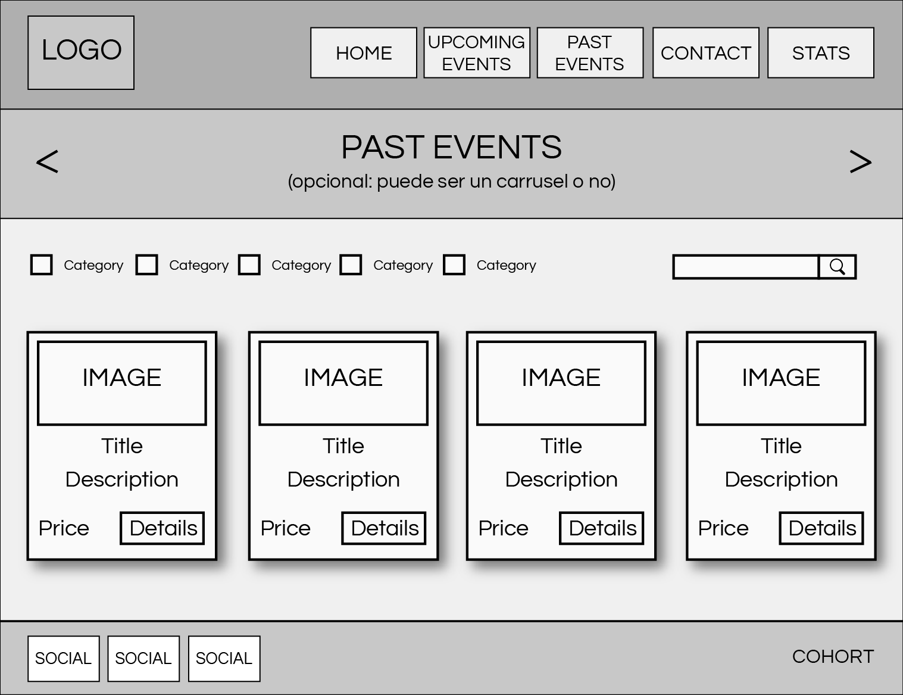
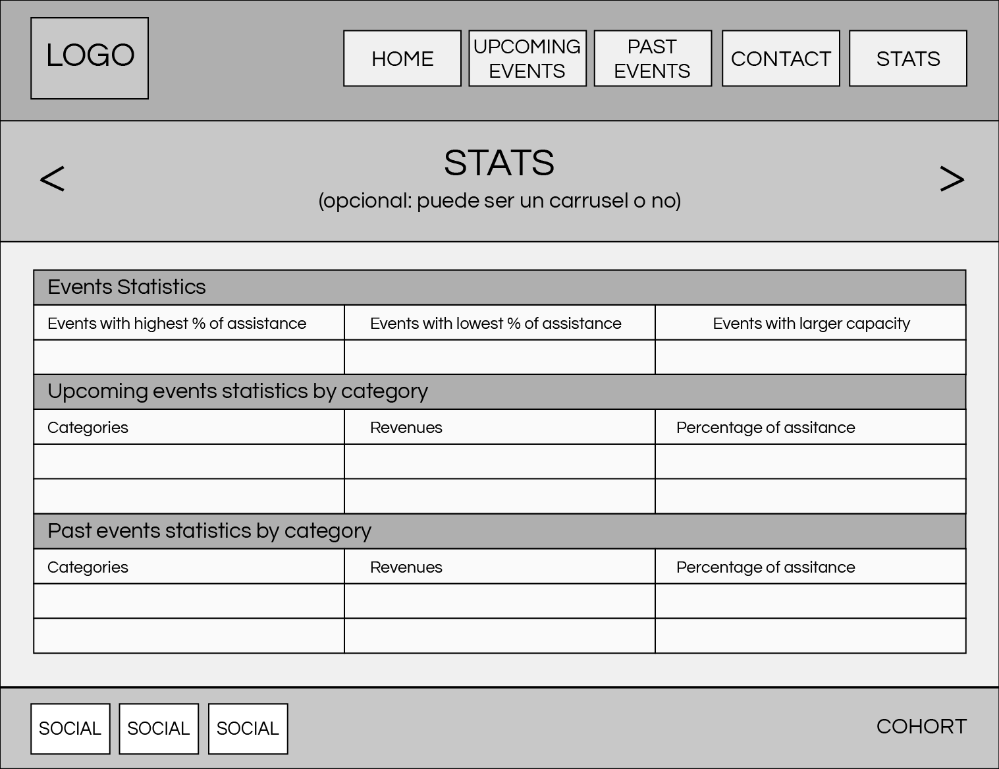
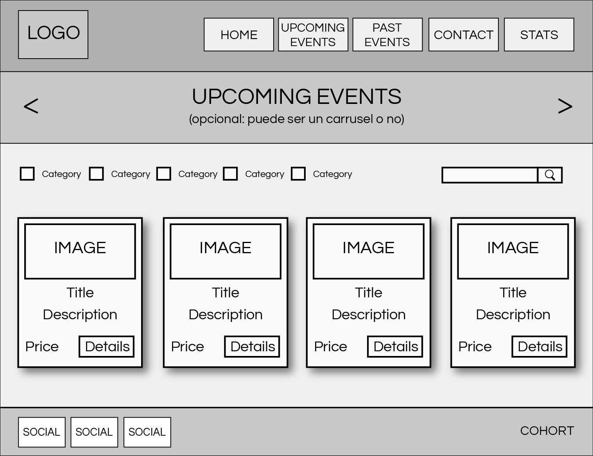

# AMAZING EVENTS 

✅Se corrige rama a sprint3 como lo pide la consigna

📌 Entrega en plataforma:
link a repo en github con nombre: AMAZINGEVENTS_APELLIDO en rama sprint3
(sin zip/rar)

📌 Consignas:
Tanto en home como en past y upcoming events deben:
- generar los checkbox dinámicamente, uno por cada categoría que exista en las categorías de eventos
- tanto el campo de búsqueda como los checkbox deben ser funcionales y filtrar los eventos de esa página
- búsqueda y checkbox deben funcionar individualmente y en conjunto
- cuando no hay resultados, mostrar un mensaje amigable al usuario
los botones de las cards de eventos deben llevar a la página de details donde se carga dinámicamente en base al parámetro de la URL la información completa del evento

📌 Recordatorios:
Un archivo js por cada sección, pueden tener otro archivo general para todas también (pongan ahí todo lo que se repita así no repiten código)
Usen funciones para modularizar el código y no repetirlo en cada archivo
Usen funciones de orden superior donde sean aplicables

📚 Entrega: Lunes 05/09 10hs

## Mockup

